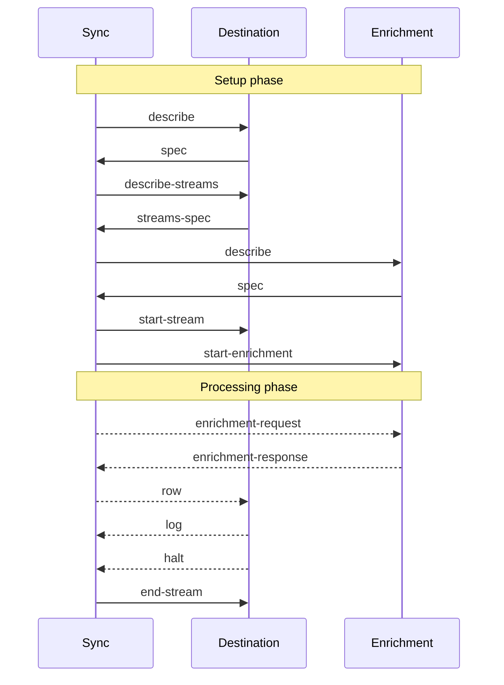

<Warning>We still actively developing the protocol. It could change significantly</Warning>

Syncmaven components communicate through a JSON-based protocol. While currently all Syncmaven components are entirely written in TypeScript,
our goal is to allow users to develop [destinations](/fundamentals/destination) in any language using Docker. In other words, a destination could be implemented in any language you prefer,
packaged into a Docker image, and set up to interact with Syncmaven using a JSON protocol via standard inputs and outputs.

The protocol operates with two entities: the destination and the enrichment. Both destination and enrichment can be bundled in a single package, sharing the same [Connection](/fundamentals/connection) credentials. The protocol also incorporates additional
components such as logging and error reporting.

**Destinations** and **enrichments** communicate with **Syncmaven** using **messages**, each represented by a JSON object. There are two types of messages:

1. **Incoming messages**: Sent from Syncmaven to enrichment or destination.
2. **Reply messages**: Sent from destination or enrichment to Syncmaven.

In addition, Syncmaven establishes a parallel communication channel for state management. **State** can be used by destinations to implement incremental
synchronization through checkpointing the status of previous runs. However, state is optional and should not be relied upon by destinations. In the absence of state,
a full synchronization should be run.

For Docker container executions, the state manager is passed in as two environment variables: `RPC_URL` and `RPC_SECRET`. Destinations should make a `POST` request
to `${RPC_URL}/<method>` with `Authorization: Bearer ${RPC_SECRET}` in the header.

# Destination flow

Here is the sequence diagram detailing the message interactions within the sync process.



# Message References


## `log` reply message

<Note>Used for `destination` and `enrichment`</Note>

A system message that can be sent by a destination or enrichment at any point to log information.

## `halt` reply message

<Note>Used for `destination` and `enrichment`</Note>

An equivalent of an exception. It signals the sync process to stop processing. Destination should use this message
if credentials are invalid, if the destination is misconfigured or if any unrecoverable error occured during the sync process.


## `describe` Incoming Message

<Note>Used for `destination` and `enrichment`</Note>

The message request `spec` is for an enrichment or destination, with only one parameter - `{"type": "describe"}`.
Upon request, the destination or enrichment responds with a `spec` message.

## `spec` reply message

<Note>Used for `destination` and `enrichment`</Note>

Defines a specification of a destination or enrichment. `credentialsSchema` maybe a Zod-schema or JSON-schema.

```json
{
  "type": "connection-spec",
  "credentialsSchema": {...} //JSON schema of credentials
}
```


## `describe-streams` incoming message

<Note>Used for `destination`</Note>

## `start-stream` incoming message

<Note>Used for `destination`</Note>

## `start-enrichment` incoming message

<Note>Used for `enrichment`</Note>

## `enrichment-request` incoming message

<Note>Used for `enrichment`</Note>

## `enrichment-reply` reply message

<Note>Used for `enrichment`</Note>


## `row` incoming message

<Note>Used for `destination`</Note>

## `end-stream` incoming message

<Note>Used for `destination`</Note>


# State management

State is used by destination to cache the artifacts of the previous run to remember what was synced to optimize subsequent runs.
It could also be used by enrichment to cache the calls to remote APIs.

<Note>
  State should be treated as optimization cache. Sync shouldn't rely on it's presence. If state is empty, a full sync should be run.
</Note>


If destination or enrichment written in TypeScript, the state manager is passed as a parameter. For docker containers, the state manager is passed in as two environment variables: `RPC_URL` and `RPC_SECRET`.
Destinations should make a `POST` request to `${RPC_URL}/<method>` with `Authorization: Bearer ${RPC_SECRET}` in the header. Each call must an JSON body, reply is also a JSON object.

## Keys and values

State is a key-value store. Keys are tuples of *segments* which are strings. If key contains one segment, it can be represented as a string instead of an array size of 1.
Values are arbitrary JSON objects.

Example of the key: `["syncId=123", "type=cursor"]`

<Note>
  You should always include a `syncId` in the key to avoid conflicts between different syncs. `syncId` is a unique identifier of the sync configuration
  and is passed along with `start-stream` or `start-enrichment` messages.
</Note>

## `state.get`

Get a value by key.

<CodeGroup>
  ```json Request
  {"key": ["segment1", "segment2"]}
  ```

  ```json Response
  {"value": {...}}
  or {} if key not found
  ```
</CodeGroup>

## `state.set`

Sets a value for a key.

<CodeGroup>
  ```json Request
  {"key": ["segment1", "segment2"], value: {}}
  ```

  ```json Response
  {} //empty json
  ```
</CodeGroup>

## `state.delete`

Deletes a value by key.

<CodeGroup>
  ```json Request
  {"key": ["segment1", "segment2"]}
  ```

  ```json Response
  {rowsDeleted: 1 or 0}
  ```
</CodeGroup>

## `state.deleteAll`

Deletes all values with keys starting with the given prefix. Include both `["segment1", "segment2"]` and `["segment1", "segment2", "segment3"]`

<CodeGroup>
  ```json Request
  {"prefix": ["segment1", "segment2"]}
  ```

  ```json Response
  {rowsDeleted: N} //number of rows deleted
  ```
</CodeGroup>


## `state.list`

List all key-value pairs with keys starting with the given prefix  (e.g. `["segment1", "segment2"]` or
`["segment1", "segment2", "segment3"]`). The response is streamed since the response can be large. It's advised to use a streaming JSON parser to process the response.

<CodeGroup>
  ```json Request
  {"prefix": ["segment1", "segment2"]}
  ```

  ```json Response
  [
    {"key": ["segment1", "segment2"], "value": {...}},
    {"key": ["segment1", "segment2", "segment3"], "value": {...}}
  ]
  ```
</CodeGroup>
